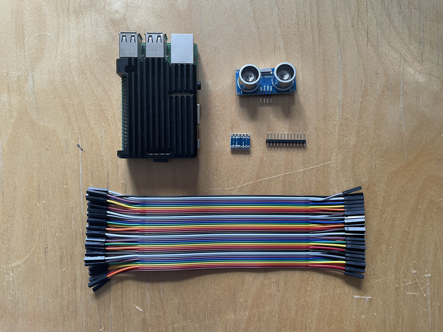
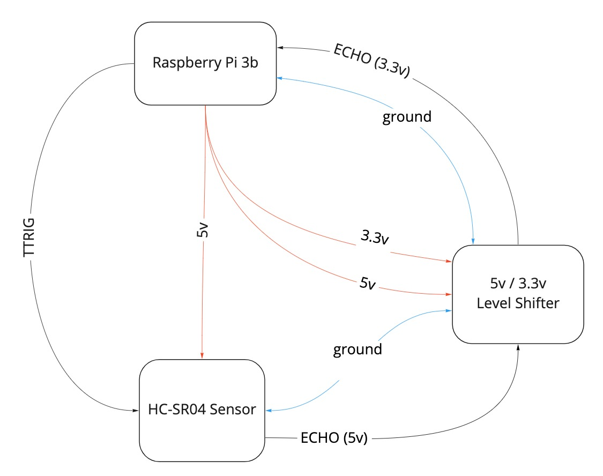
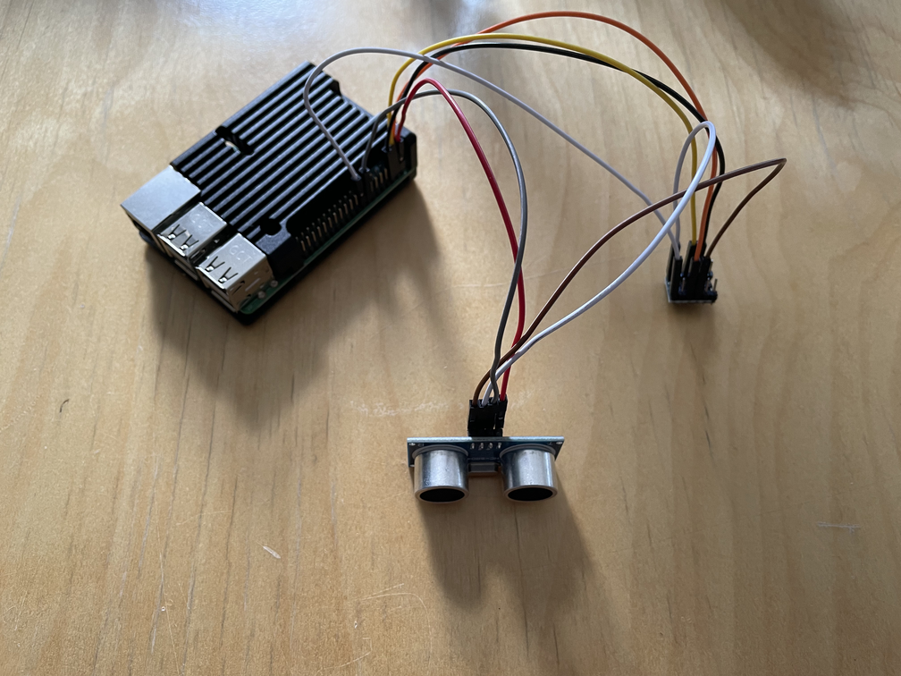
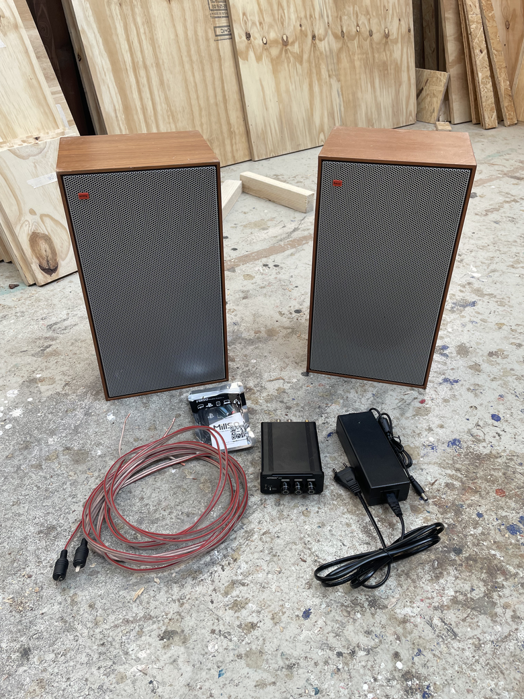
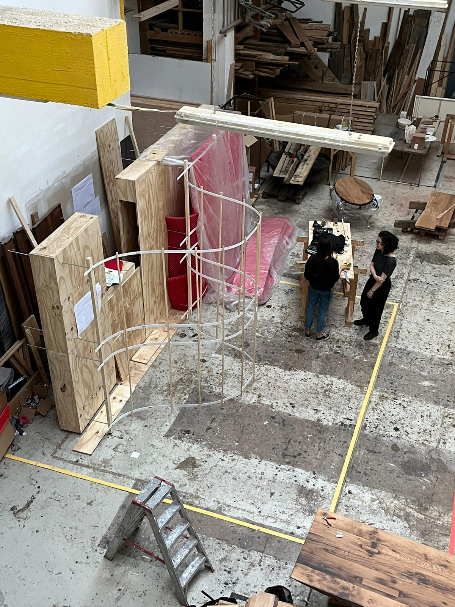
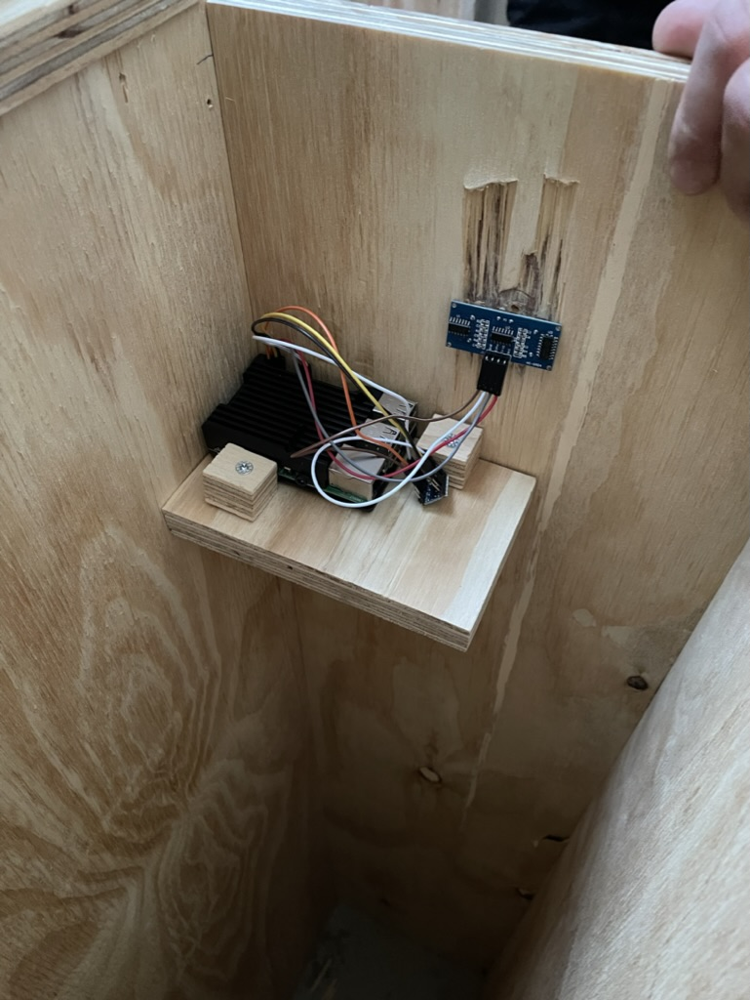
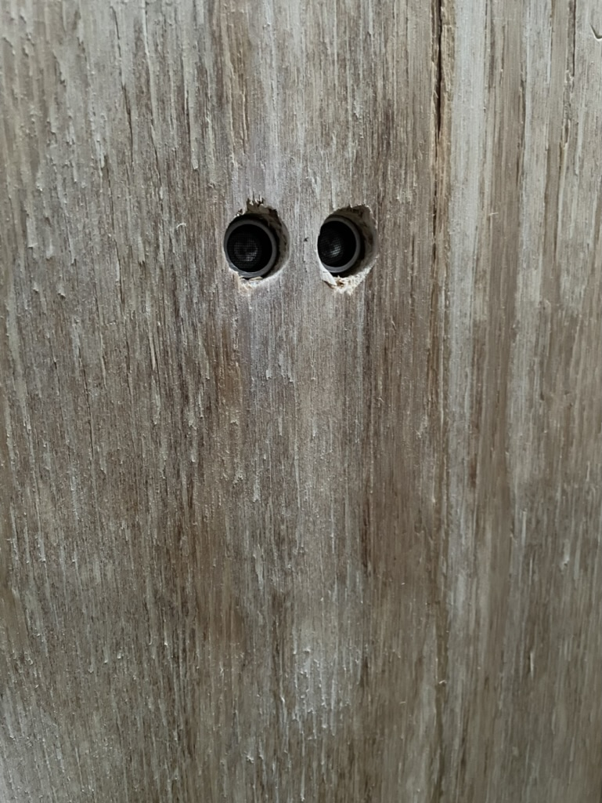

# WOMB Installation at 48hours Neukölln 
Documentation for the 2022 installation project "WOMB", which was exhibited at 48h Neuköln in Berlin. 

The installation itself was the combination of a physical intractable wooden structure, an audio system, a sensor system and a musical composition. 

# Components and Setup

## Raspberry Pi 3b, HC-SR04 Ultrasonic Range Sensor and Level Shifter

     

The Raspberry was in charge of registering distance data of the installation door and playing audio. If the door was open, the audio would stop / not be playing. If the door was closed (ie someone had entered the exhibition) the audio would play.

As the ECHO output from the sensor outputs a 5v signal, a level shifter was needed to prepare a 3.3v signal for the GPIO pins of the Raspberry Pi.

### Raspberry Pi and Sensor

     

General Notes:
- TRIG = GPIO 23 (output)
- ECHO = GPIO 24 (input) via level shifter
- VCC receives 5v from Raspberry Pi. 
- Ground connection to sensor via voltage transformer

Voltage transformer receives: 
- 3.3v on the LV side 
- 5v on the HV side
- GND connects to ground on Raspberry and ground on sensor. 
- Output from ECHO pin of sensor into HV channel, then from LV partner channel to GPIO 24 on Raspi (as mentioned above)



#### Final Python Script

Built using Raspian Bullseye. All libraries are preinstalled with the OS.
The script was set to run automatically on boot:

1. Open rc.local
   ```sudo nano /etc/rc.local```
2. Add the run command at the end before ```exit 0```. The ampersand is used if a program runs in an infinite loop.
   ```sudo python3 /home/pi/WOMB-Installation/raspi-files/python/SR04-sensor1.03.py &```
3. ```sudo reboot```

[Here is the file itself](./raspi-files/python/SR04-sensor1.03.py) in this repo. 

```python
#!/usr/bin/python3
# https://www.youtube.com/watch?v=JvQKZXCYMUM

import RPi.GPIO as GPIO
import pygame
from threading import Thread
from signal import signal, SIGTERM, SIGHUP, pause
from time import sleep
from gpiozero import DistanceSensor

pygame.mixer.init(frequency=44100, size=-16, channels=2, buffer=512)

audio_file = pygame.mixer.Sound('/home/pi/WOMB-Installation/raspi-files/audio/womb-track-2.01-16bit.wav')

reading = True
# give arguments for sensor. Max distance is the furthest distance to raed. 
# Threshold distance is the crossover value to use in conjunction with methods .when_in_range and .when_out_of_range
sensor = DistanceSensor(echo=24, trigger=23, max_distance=1, threshold_distance=0.2)

def safe_exit(signum, frame):
	exit(1)

def play_audio():
	audio_file.play()

def stop_audio():
	#audio_file.stop()
	pygame.mixer.fadeout(3000)

def read_distance():
    while reading:
        print("Distance (cm): ", sensor.distance * 100)
        sleep(0.1)
        sensor.when_in_range = play_audio
        sensor.when_out_of_range = stop_audio


signal(SIGTERM, safe_exit)
signal(SIGHUP, safe_exit)

try:
# Here using threading to keep processes controlled and code cleaner.
    reader = Thread(target=read_distance, daemon=True)
    reader.start()  

    pause()

except KeyboardInterrupt:
	pass

finally:
	reading = False
	sensor.close()

```


## Sound System


The sound system comprises of: 
- 2 x Heco P3302 speakers (chosen due to their depth being less than 20cm, which was the interior depth of the walls where the speakers were installed. These are however also a great sounding loud speaker)
- 1 x AIYIMA A05 100w amplifier (compact 100w amp for €80!)
- Cabling (audio output directly from 3.5mm socket of Raspberry Pi)

## Construction / System Integration

Construction took place at WOODBOOM in Lichtenberg, Berlin. The structure is modular so it can be easily assembled / reassembled and transported. 


The Raspberry Pi and sensor were installed in the side of the top most central panel, facing inner face of the sliding door.   
   
   

Even though the trigger and echo membranes were receded approx 0.5-1cm inside the wood, there was no loss in measurement accuracy or performance. 

## The Exhibition

The exhibition ran for two days, eight hours continuous each day. Over these two days, there was only one technical malfunction.   
About four hours into the first day, the music started to sporadically restart, play for 10 or so seconds, then restart again. This happened in a loop.   
I checked the readout of the distances, and even though with the door closed (which equals a distance from sensor to door frame of approx 4cm), the sensor was moving between 8-10cm.   
As the ```threshold_distance``` in the sensor setup was set to 0.1m, the music was being restarted.    

I'm still not sure what exactly caused this sudden change in behaviour. It could've been the heat (as the raspberry was at the top of an enclosed thick wooden box with no ventilation holes, and the exhibition was outside in direct sunlight on a 32 degree day 😅) or it could have been from the repetitive shock of the heavy sliding door hitting the panel where the sensor was installed. Perhaps a membrane of the sensor got vibrated out of position? In any case, a threshold of 20cm is still a very safe range to register the sliding door being open / closed.

## Final Thoughts

Overall, The exhibition went great and I wouldn't have done much different except for two thoughts for next time:

- It would have been great to implement a counter, to count how many people visited the exhibition. 
- I totally forgot to check in about ventilation holes, but it's good to know that the raspberry can withstand such conditions. 
